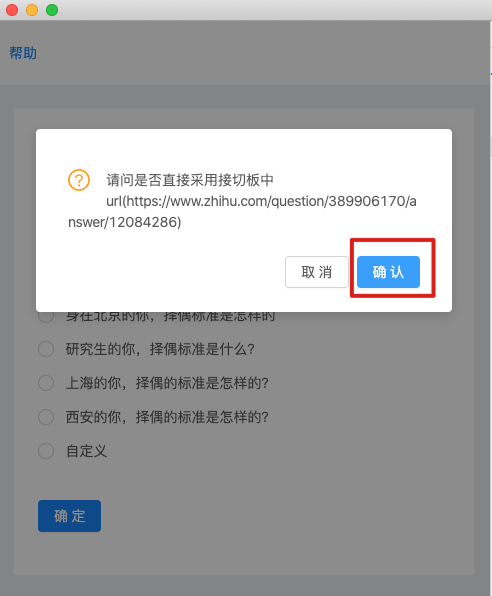

# 文章过滤器

之前看到知乎的相亲贴想解决自身单身问题，但是发现无法根据条件进行过滤，比较多的帖子现在已经3w+了，因此产生了写一个软件对所有帖子进行过滤的想法。虽然发现自己能符合条件的帖子真的不多，不过也是希望能帮助大家找到自己心仪另一半。

如果是同行希望能star一下，有问题直接在github上提问即可。如果不了解github如何使用，问题直接提在知乎帖子下面即可，这样有相同问题的人可以在评论中找到答案。

##  下载

windows 暂未支持

[macos](https://github.com/akrio714/zhihu-love/releases)

##  使用手册

第一次进入页面会进入引导页面，此时可以选择预设的问题(非自定义项)。然后点击确认即可

如果预设问题无法符合要求可直接知乎中复制想要筛选的问题url链接

回到app中，测试会自动打开提示信息，直接点击确定会自动切换自定义模式并填写url，最后点击最下方确认按钮即可

默认会拉取最近1月的帖子，进入查询页面点击右下角按钮实现条件过滤

添加对应的查询条件后点击查询，完成对数据的过滤

如需要添加新的知乎问题，可点击左侧帖子按钮

然后点击+按钮完成帖子的添加，此处url直接填写知乎帖子的完整url即可

添加成功之后之后进入设置页面修改帖子即可

##  TODO List

- [ ] 项目重启后查询条件保持不变
- [ ] 支持多个问题同时查询(现在为单文章拉取)
- [ ] 支持查询圈子
- [ ] 支持项目内预览文章全文(现在为打开浏览器跳转原文)
- [ ] 支持文章自动增量更新，即定时拉取最新文章(现在只能全部拉取)
- [ ] 支持文章分析 -分析更新频率，实名作者分析活跃情况，防止小号诈骗行为(如注册10天，就发了1个帖子就很可疑)
- [ ] 支持身高体重过滤(根据文案进行分析，大概率算不准，如果大佬有算法求分享)